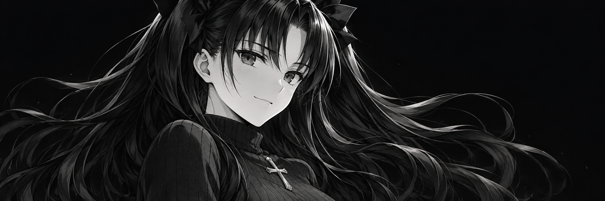

  

<h3 align="center">Hi! I sometimes do cool stuff.</h3>

 

### Projects

#### [embed.cat](https://github.com/justkiddingxd/embedcat)

A Discord embed & Components V2 builder.

TypeScript / React / Next.js

[Open app](https://embed.cat) &nbsp; / &nbsp; [Source](https://github.com/justkiddingxd/embedcat)

---

#### [Dota 2 Grid Toolkit](https://github.com/justkiddingxd/dota2-grid-toolkit)

Offline tools for creating Dota 2 hero grids.

Fork of <a href="https://github.com/linsisss/dota2-grid-toolkit">linsisss/dota2-grid-toolkit</a>

[Source](https://github.com/justkiddingxd/dota2-grid-toolkit)

<!-- Add future projects above this comment: a divider, project heading, description, and links. -->

 

[rin.ms](https://rin.ms) &nbsp; / &nbsp; [All repositories](https://github.com/justkiddingxd?tab=repositories)
